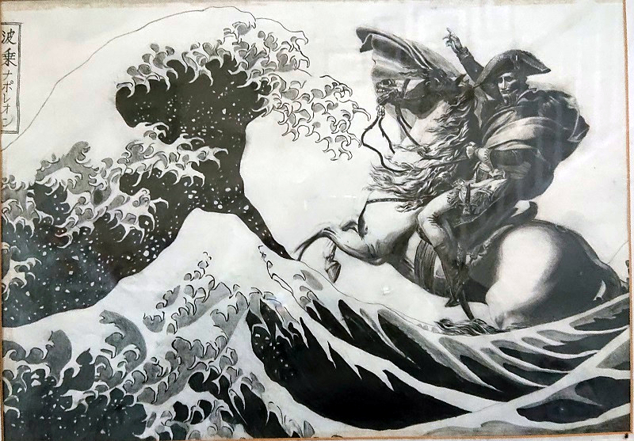
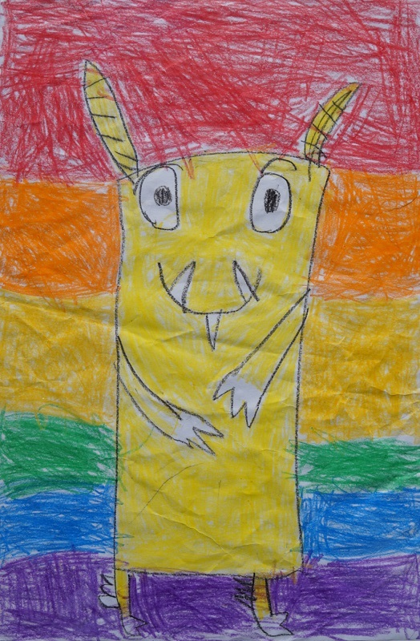
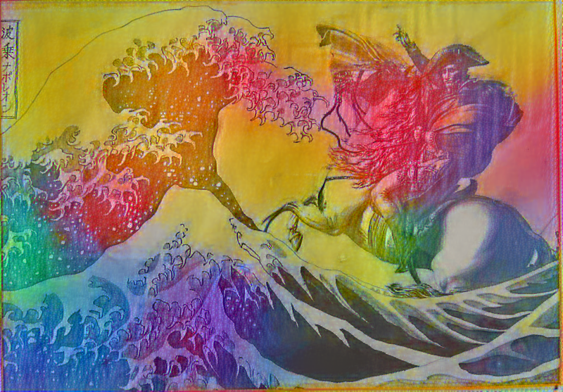
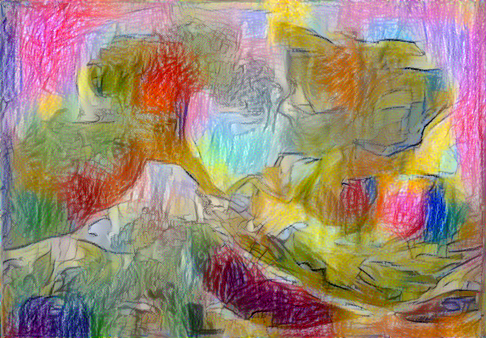

# Neural Style Transfer (Parent-Child Art)  
My 7-year-old daughter is an infinite source of inspiration! We worked together to create a parent-child art using neural style transfer.  

感動の父と娘（7才）の共同作品です。画風変換。  
  
  

## Content  
### My drawing (at age 17)  
#### Napoleon on Tsunami (波乗りナポレオン)  
  

## Style  
### My daughter's crayon art (at age 6)  
#### Kaiju (かいじゅう)  
  

## Code  
- **[Less style weight code](https://github.com/yuibi/neural_style_transfer_crayon/blob/master/style_transfer_crayon_low_style_weight.ipynb)**  
  
- **[More style weight code](https://github.com/yuibi/neural_style_transfer_crayon/blob/master/style_transfer_crayon_high_style_weight.ipynb)**  
  

